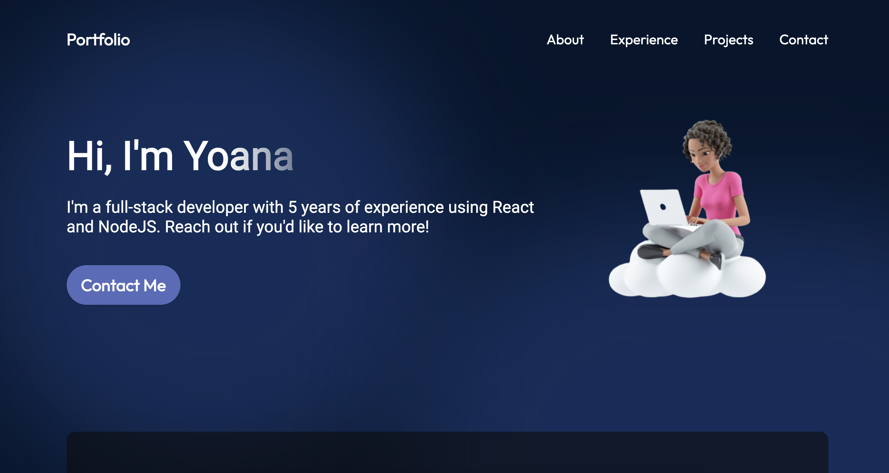

# My Personal Portfolio Site

Welcome to my personal portfolio website, a virtual space crafted with elegance and precision, designed to showcase my skills, projects, and professional journey. Thank you for visiting!

## Table of Contents 📝

1. [About the Project](#about-the-project)
2. [Key Features](#key-features)
3. [Technologies Used](#technologies-used)
4. [Setup and Deployment](#setup-and-deployment)
5. [Local Development](#local-development)
6. [Contributing](#contributing)
7. [Acknowledgments](#acknowledgments)
8. [Contact Information](#contact-information)

## About the Project

The idea of the project is to have a good looking portfolio page. It serves as a digital canvas where I display my work and projects, and share insights about the technologies I use.

## Deployment

[Yoanastamenova.com](https://yoanastamenova.github.io/Yoanastamenova.com/)

## Technologies Used

Technologies used in the project:

## Key Features

This website is built with the user experience firmly in mind, providing a seamless interaction and visually engaging design:

- **Project Showcases**: Interactive display of all projects I've worked on, with detailed explanations and high-quality images.
- **Blog**: A section for articles and blogs where I share deeper insights about technology trends, project walkthroughs, and more.
- **Responsive Design**: Fully responsive on mobile, tablet, and desktop views.
- **Contact Form**: Integrated contact form for potential clients and collaborators to reach out directly through the website.

## Contact

